<div align="center">
  
  <h1 style="margin: 25px 0 10px; font-size: 42px; color: #c9d1d9; font-weight: 700;">Vicky Kumar</h1>
  <p style="font-size: 20px; color: #8b949e; margin: 0 0 25px; letter-spacing: 0.5px;">
    <span style="color: #FF6B6B; font-weight: 600;">AI Engineer</span> · 
    <span style="color: #58a6ff; font-weight: 600;">Full-Stack Developer</span> · 
    <span style="color: #a371f7; font-weight: 600;">Agentic Systems Builder</span>
  </p>
  
  <div style="display: flex; gap: 12px; justify-content: center; flex-wrap: wrap; margin-bottom: 30px;">
    <a href="https://github.com/FiscalMindset"></a>
    <a href="https://github.com/algsoch"></a>
    <a href="https://github.com/blindfold-org"></a>
    <a href="https://www.linkedin.com/in/algsoch"></a>
    <a href="https://algsoch.com"></a>
  </div>

  <p style="font-size: 16px; color: #6e7681; max-width: 650px; line-height: 1.6;">
    Building <strong>agentic AI systems</strong>, <strong>open-source integrations</strong>, and <strong>real-world automation tools</strong>.
  </p>
</div>

---

## TL;DR

| | |
|:--|:--|
| **Who** | AI Engineer specializing in agentic systems & on-device AI |
| **What I Build** | Multi-agent pipelines, offline-capable apps, workflow automation |
| **Stack** | Python · Kotlin · TypeScript · LangGraph · RunAnywhere SDK · Coral |
| **Open Source** | 14 PRs merged · 20 open · 6 approved — Coral MCP |

| **Achievements** | Pull Shark (170+ PRs merged) · YOLO · Quickdraw (< 5 min merge) |
---

## Philosophy

> "I build software systems, AI-native products, and agentic interfaces that turn ideas into usable, operational products."

- **AI should operate inside a product, not beside it.** A useful system is not just model output. It is the interface, the workflow, the state model, and the decisions around trust.

- **Good AI UX is engineering work.** Latency, control, explainability, failure states, response structure, and operator confidence are implementation concerns, not polish afterthoughts.

- **Workflow design matters more than prompt cleverness.** The strongest systems are built around routes, actions, validation, and output quality, not one-off prompting tricks.

- **Applied intelligence should feel calm and exact.** Serious products communicate precision through restraint, hierarchy, and interface clarity, not through noise.

---

## Featured Projects

### 🏆 On-Device AI Learning — algsoch

[**algsoch**](https://github.com/FiscalMindset/algsoch) — Android AI Study Companion
- **100% Offline** — AI runs entirely on-device via RunAnywhere SDK
- **7 Learning Modes** — Direct, Explain, Notes, Theory, Creative, Answer, Direction
- **SmolLM2-360M + SmolVLM-256M** running locally on Android
- Built with Kotlin + Jetpack Compose + RunAnywhere SDK
- [YouTube Demo](https://youtu.be/8L3svJ2HgI0)

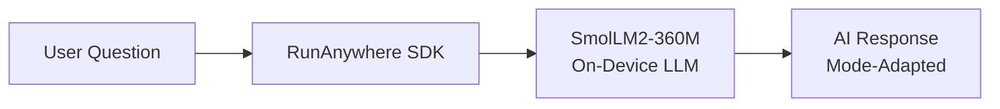

---

### 📰 Multi-Agent AI Newsroom — algsochnews

[**algsochnews**](https://github.com/FiscalMindset/algsochnews) — AI-Powered News Pipeline
- **5-Agent orchestration** — Article Extraction → News Editor → Visual Packaging → QA → Video Generation
- **Parallel processing** with conditional retry routing
- **Broadcast-native output** — Screenplay JSON, timed visuals, MP4 video
- Built with **LangGraph** + **FastAPI** + **React**
- Live: [Frontend](https://algsochnews-1.onrender.com) · [API](https://algsochnews.onrender.com)

[Demo](https://youtu.be/vX4ZxSSpP8M)

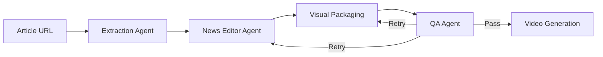

---

### 🏥 Healthcare AI — careops

[**careops**](https://github.com/FiscalMindset/careops) — Coral-Powered Family Care Coordination
- **9 Coral sources** joined via single SQL interface
- Generates **doctor-ready visit packets** from scattered medical records
- Timeline synthesis across prescriptions, lab reports, symptoms, appointments
- Safety guardrails — never diagnoses or prescribes
- Built with **Next.js 15** + **Coral SQL** + **TypeScript**
- 22 tests passing (13 careops + 9 coral-cli)

[Demo](https://youtu.be/TAOyyIH2_rc)

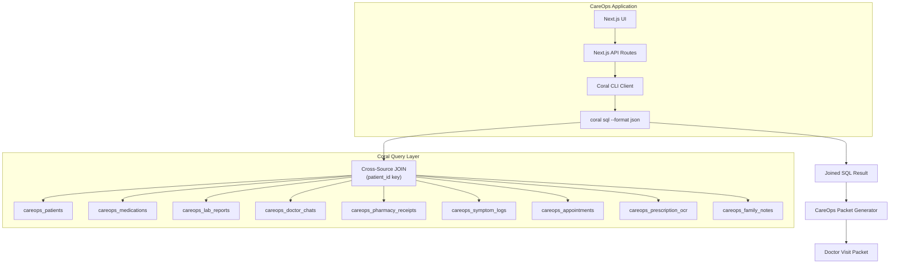

---

### 🎬 Video Dubbing — ChitraDub

[**chitradub**](https://github.com/FiscalMindset/chitradub) — Open-Source Video Dubbing Pipeline
- Paste a **YouTube URL** or upload a video → get a **dubbed MP4 + SRT** back
- **12 target languages** across **5 source languages** — powered by AI4Bharat
- Full **12-stage pipeline** with CI, Docker, Release, and pre-commit automation
- Built with **Python** + **Next.js 15** + **FastAPI** + **Postgres**

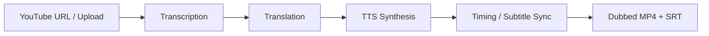

---

### 🛡️ Secrets Security — Blindfold

[**Blindfold**](https://github.com/blindfold-org/Blindfold) — [blindfold-org](https://github.com/blindfold-org) · Live: [blindfold-rho.vercel.app](https://blindfold-rho.vercel.app/)
- **Your AI agent can't leak the API key it never had** — TDX enclave wrapper
- Seal and use API keys inside a trusted execution enclave
- No-paste workflow — verify by fingerprint, never write keys to disk
- Built with **TypeScript** · Terminal 3 TDX enclave integration

---

### 🎓 Voice & Command Systems

[**CommandBrain**](https://github.com/algsoch/smart_terminal) — RunAnywhere Command Memory
- **Offline-first** command copilot that turns natural language into reusable shell commands
- Local command memory stored in IndexedDB — favorites, macros, reminders, patterns
- Safety classification with simulate/real execution modes
- Built with **React + TypeScript + RunAnywhere Web SDK**
- [Live Demo](https://smart-terminal.onrender.com) · [YouTube](https://www.youtube.com/shorts/mMPo7_v08pE)

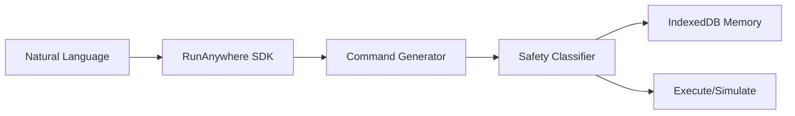

[**SpeakAI**](https://github.com/algsoch/speakai) — Local English Practice
- **100% on-device** English speaking practice via RunAnywhere Web SDK + llama.cpp WASM
- Browser speech immediately OR optional one-time local model download
- Personality + practice modes with text + voice responses
- No API keys, no server dependency
- [Live Demo](https://speakai-af1l.onrender.com)

---

### 🎓 Education & Language Learning

| Project | Description | Account |
|---------|-------------|:-------:|
| [english_bot](https://github.com/algsoch/english_bot) | AI conversation practice with speech recognition | [algsoch](https://github.com/algsoch) |

---

## All Projects

### 📱 Mobile AI (On-Device)

| Project | Description | Account |
|---------|-------------|:-------:|
| [algsoch](https://github.com/FiscalMindset/algsoch) | Android AI study companion, 7 learning modes, 100% offline | [FiscalMindset](https://github.com/FiscalMindset) |
| [algsochvicky](https://github.com/FiscalMindset/algsochvicky) | Portfolio website deployed on Render | [FiscalMindset](https://github.com/FiscalMindset) |

### 🤖 Agentic AI Systems

| Project | Description | Account |
|---------|-------------|:-------:|
| [algsochnews](https://github.com/FiscalMindset/algsochnews) | Multi-agent newsroom with 5 agents + video generation | [FiscalMindset](https://github.com/FiscalMindset) |
| [careops](https://github.com/FiscalMindset/careops) | Coral-powered family care coordination agent | [FiscalMindset](https://github.com/FiscalMindset) |
| [Cognivise](https://github.com/algsoch/Cognivise) | Real-time adaptive tutoring with eye tracking | [algsoch](https://github.com/algsoch) |
| [agentic_chat](https://github.com/FiscalMindset/agentic_chat) | Conversational session history with OpenCode · [Dashboard](https://agentic-dashboard-qzen.onrender.com/) | [FiscalMindset](https://github.com/FiscalMindset) |
| [vickykumar](https://github.com/FiscalMindset/vickykumar) | algsoch — personal AI chatbot trained on your digital footprint · [Live](https://algsoch.com/) | [FiscalMindset](https://github.com/FiscalMindset) |

### 🎬 Media & Video

| Project | Description | Account |
|---------|-------------|:-------:|
| [chitradub](https://github.com/FiscalMindset/chitradub) | Video dubbing pipeline — YouTube URL/upload → dubbed MP4 + SRT | [FiscalMindset](https://github.com/FiscalMindset) |
| [video](https://github.com/FiscalMindset/video) | Reelforge — AI-native web video editor with timeline-based AI agent | [FiscalMindset](https://github.com/FiscalMindset) |

### 🛡️ Security & Privacy

| Project | Description | Account |
|---------|-------------|:-------:|
| [Blindfold](https://github.com/blindfold-org/Blindfold) | TDX enclave wrapper — AI agents never see or leak the keys they use | [blindfold-org](https://github.com/blindfold-org) |
| [footprint](https://github.com/FiscalMindset/footprint) | Personal digital-footprint analytics — static, private, local-first, 12 services | [FiscalMindset](https://github.com/FiscalMindset) |

### 🛠️ Developer Tooling

| Project | Description | Account |
|---------|-------------|:-------:|
| [scrapper](https://github.com/FiscalMindset/scrapper) | Scrape-Verse Sentinel — self-healing web context for AI coding agents | [FiscalMindset](https://github.com/FiscalMindset) |
| [coral_benchmarks](https://github.com/FiscalMindset/coral_benchmarks) | Per-spec query benchmarks for Coral sources · [Live](https://coral-benchmarks.onrender.com) | [FiscalMindset](https://github.com/FiscalMindset) |

### 🌐 Web & Community

| Project | Description | Account |
|---------|-------------|:-------:|
| [ghevra](https://github.com/FiscalMindset/ghevra) | Community transparency portal for Ghevra village — EN / Hindi / Haryanvi | [FiscalMindset](https://github.com/FiscalMindset) |
| [polybazar](https://github.com/algsoch/polybazar) | E-commerce platform | [algsoch](https://github.com/algsoch) |
| [smart_terminal](https://github.com/algsoch/smart_terminal) | RunAnywhere CommandBrain — offline CLI assistant | [algsoch](https://github.com/algsoch) |

### 🎓 Education & Language Learning

| Project | Description | Account |
|---------|-------------|:-------:|
| [english_bot](https://github.com/algsoch/english_bot) | AI conversation practice with speech recognition | [algsoch](https://github.com/algsoch) |
| [speakai](https://github.com/algsoch/speakai) | On-browser English practice with RunAnywhere WASM | [algsoch](https://github.com/algsoch) |

### 🏢 Organisation — blindfold-org

First GitHub organisation: [**blindfold-org**](https://github.com/blindfold-org)

| Project | Description |
|---------|-------------|
| [Blindfold](https://github.com/blindfold-org/Blindfold) | TDX enclave secrets wrapper · [Live](https://blindfold-rho.vercel.app/) |
| [vickyhairsaloon](https://github.com/blindfold-org/vickyhairsaloon) | Production-grade unisex salon platform |

---

## Project Architectures

Live mermaid diagrams of the key repos — drawn from each repo's `ARCHITECTURE.md`.

### 🎬 chitradub — Real-Dubbing Pipeline

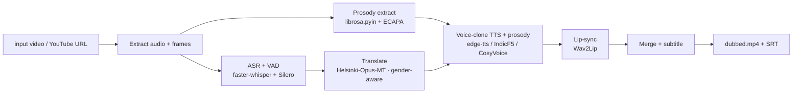

### 🤖 agentic_chat — agentic-dashboard

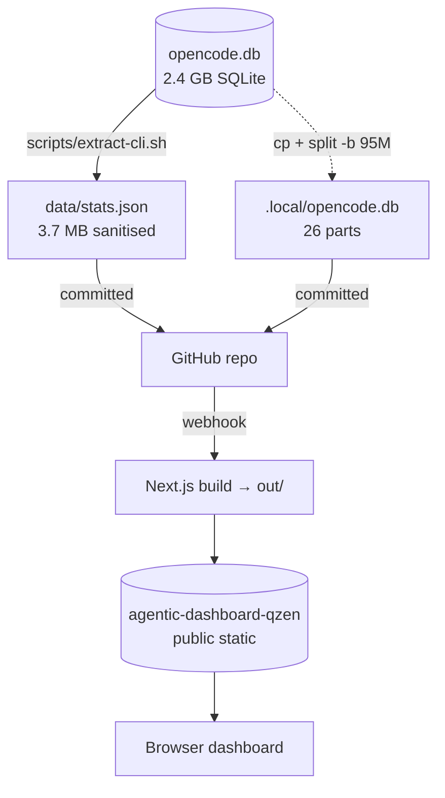

### 🔍 footprint — Digital-Footprint Analytics

```mermaid
flowchart LR
    SRC[Raw exports<br/>gmail · openai · telegram · zoom] -->|sync-and-rebuild.mjs| DATA[data/raw/&lt;source&gt;]
    DATA -->|build-data.ts + per-source parsers| PIPE[manifests + public/data JSON]
    PIPE -->|generate-og.ts| OG[Per-app OG SVGs]
    PIPE -->|next build (static export)| OUT[./out · 498 routes]
    OG --> OUT
    OUT -->|deploy anywhere| HOST[Render · Vercel · S3 · nginx + Cloudflare]
```

### 🎥 video — Reelforge Editor

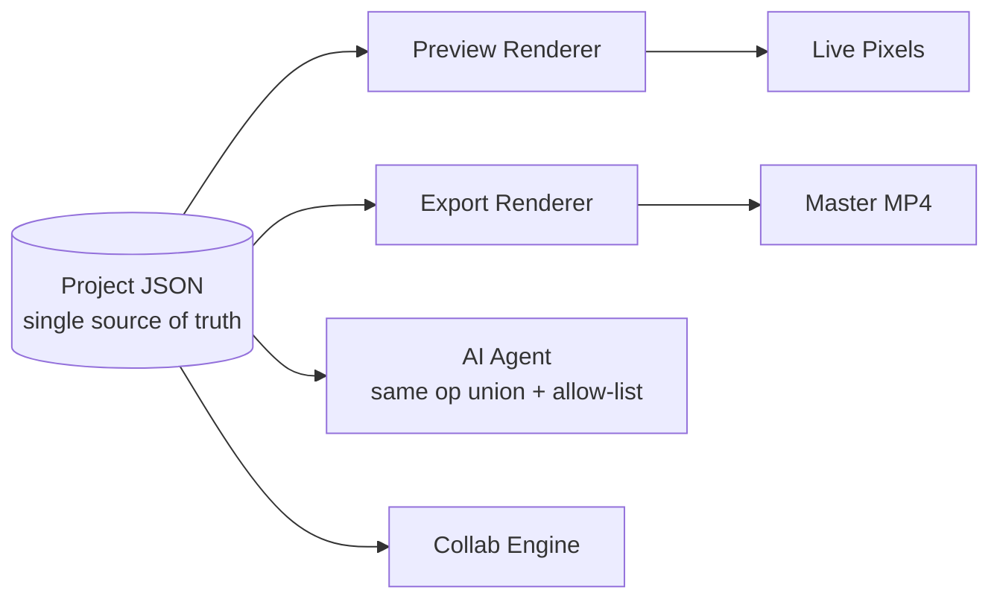

### 🕷️ scrapper — Scrape-Verse Sentinel

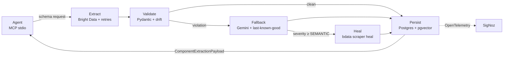

### 🌐 ghevra — Ghevra Citizen Portal

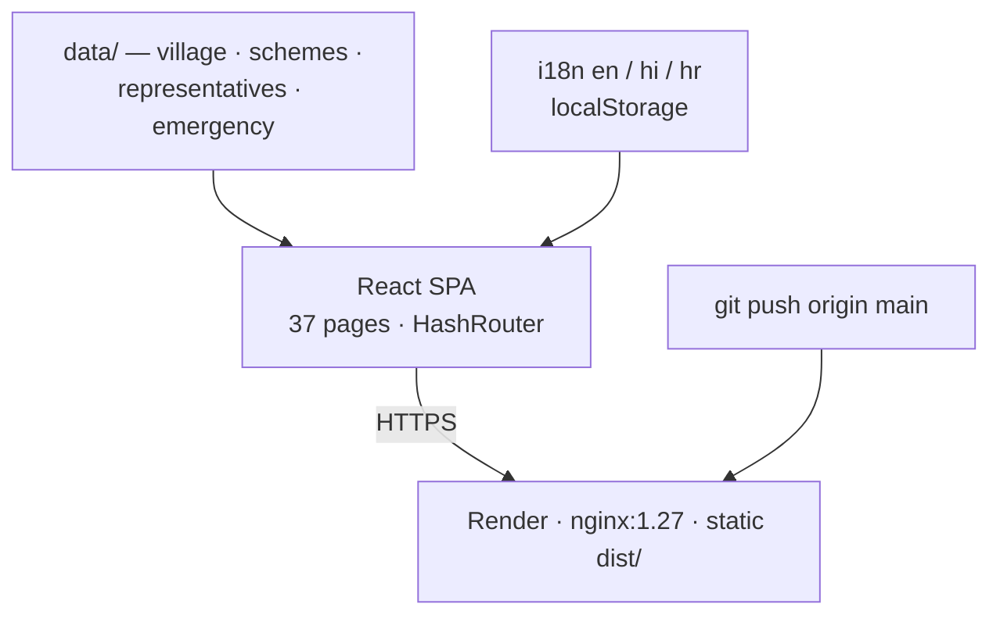

### 🛡️ Blindfold — TDX Secrets Wrapper

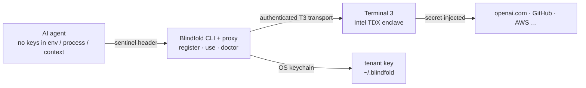

### 🤖 vickykumar — algsoch personal AI

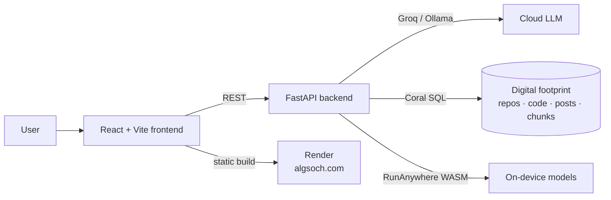

### 📊 coral_benchmarks — Coral QA Evidence

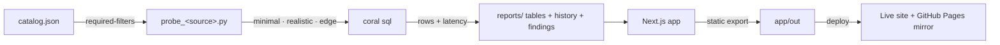

---

## Open Source Contributions

### Coral MCP — 14 PRs Merged · 20 Open · 6 Approved

Contributor to [Coral](https://github.com/withcoral/coral) — SQL-based data abstraction layer for AI agents. Integrated 8 AI providers:

| Provider | PR | Description |
|:---------|:---|:------------|
| Voyage AI | [#1115](https://github.com/withcoral/coral/pull/1115) | Vector search integration |
| Sarvam AI | [#1112](https://github.com/withcoral/coral/pull/1112) | Indian language TTS/STT |
| Cohere AI | [#1098](https://github.com/withcoral/coral/pull/1098) | Command R integration |
| Mistral AI | [#1011](https://github.com/withcoral/coral/pull/1011) | Mistral model support |
| OpenRouter | [#882](https://github.com/withcoral/coral/pull/882) | Unified API gateway |
| LM Studio | [#834](https://github.com/withcoral/coral/pull/834) | Local model serving |
| Ollama | [#798](https://github.com/withcoral/coral/pull/798) | Local LLM inference |
| Groq AI | [#754](https://github.com/withcoral/coral/pull/754) | Fast inference provider |

- **Merged: 14** · **Open: 20** (6 approved, awaiting merge) · **Closed without merge: 2**
- 13 review comments given across 5 reviewed PRs

[View all PRs →](https://github.com/withcoral/coral/pulls?q=author%3AFiscalMindset)

---

## Skills & Tech Stack

### AI Engineering

| Category | Technologies |
|:---------|:------------|
| **On-Device AI** | RunAnywhere SDK, ONNX Runtime, WebAssembly, SmolLM2, SmolVLM |
| **LLM & Agents** | LangChain, LangGraph, Prompt Engineering, RAG, Multi-Agent Systems |
| **Model Ops** | LLM Evaluation, Hallucination Analysis, Response Evaluation |
| **Vision & Speech** | Whisper, SmolVLM, Image Analysis, OCR, Web Speech API |

### Development

| Category | Technologies |
|:---------|:------------|
| **Languages** | Python, Kotlin, JavaScript, TypeScript, SQL |
| **Mobile** | Android, Jetpack Compose, React Native |
| **Frontend** | React, Next.js, Tailwind CSS, Vite |
| **Backend** | FastAPI, Node.js, PostgreSQL |

### Infrastructure

| Category | Technologies |
|:---------|:------------|
| **Orchestration** | Kestra, GitHub Actions, Docker |
| **Data** | Coral SQL, JSONL, SQLite, OpenMetadata |
| **Deployment** | Render, Vercel, ngrok |

### Writing

| Article | Publication |
|:--------|:------------|
| [How I Built CareOps Agent with Coral + OpenCode](https://medium.com/@algsoch/how-i-built-careops-agent-with-coral-opencode-338d1238e6ae) | Medium |
| [Cognivise — Real-Time Cognitive AI Tutor](https://medium.com/@algsoch/cognivise-a-real-time-cognitive-ai-tutor-using-vision-agents-sdk-a33ef92d4666) | Medium |

### IDE & Tools

| | |
|:--|:--|
| **AI Coding** | OpenCode, Codex, AntiGravity, Kimchi, OpenClaw |
| **Code Editor** | VS Code, Cursor, JetBrains IDEs |
| **Terminal** | Warp, Hyper, iTerm2 |
| **Other** | Claude, ChatGPT, Gemini |

### Awards & Recognition

| Achievement | Details |
|:------------|:--------|
| **Coral Hackathon Track 2** | 1st place — CareOps agent with 9 Coral sources |
| **Pull Shark** | 170+ PRs merged on GitHub (14 to Coral MCP) |
| **YOLO** | Fast merge achievement |
| **Quickdraw** | < 5 min merge time |

### Languages

| | |
|:--|:--|
| **Spoken** | English, Hindi |
| **Programming** | Python, Kotlin, JavaScript, TypeScript, SQL |

---

## GitHub Stats

| Account | Repos | Stars | PRs Merged | Contributions |
|:--------|:-----:|:-----:|:----------:|:-------------:|
| [@FiscalMindset](https://github.com/FiscalMindset) | 56 | 6 | 170+ | — |
| [@algsoch](https://github.com/algsoch) | 104+ | 24+ | 14 | 350+ |
| [@blindfold-org](https://github.com/blindfold-org) | 2 | — | — | — |

**🏆 Pull Shark** (170+ PRs merged) · **YOLO** · **Quickdraw** (< 5 min merge)

---

## Featured Work Highlights

<div align="center">

| Project | Impact | Link |
|:--------|:-------|:-----|
| 🎬 **ChitraDub** | YouTube URL / upload → dubbed MP4 + SRT in 12 languages | [GitHub](https://github.com/FiscalMindset/chitradub) |
| 🛡️ **Blindfold** | AI agents never touch the API keys they use — TDX enclave | [Live](https://blindfold-rho.vercel.app/) |
| 🤖 **algsoch (AI)** | Personal AI chatbot trained on your digital footprint | [Live](https://algsoch.com/) |
| 🧠 **CommandBrain** | Offline-first command memory + execution copilot, IndexedDB storage | [Live Demo](https://smart-terminal.onrender.com) |
| 🎙️ **SpeakAI** | 100% on-device English practice via RunAnywhere WASM | [Live Demo](https://speakai-af1l.onrender.com) |
| 📱 **algsoch Android** | 100% offline AI, 7 learning modes, RunAnywhere SDK | [GitHub](https://github.com/FiscalMindset/algsoch) |
| 📺 **algsochnews** | 5-agent pipeline → broadcast video from any article URL | [Live Demo](https://algsochnews-1.onrender.com) |
| 🏥 **careops** | 9 data sources joined via Coral SQL for family care coordination | [GitHub](https://github.com/FiscalMindset/careops) |
| 📊 **coral_benchmarks** | Per-spec query benchmarks for every Coral source | [Live](https://coral-benchmarks.onrender.com) |

</div>

---

## Let's Connect

<div align="center">

| Platform | Badge |
|:---------|:------|
| [LinkedIn](https://www.linkedin.com/in/algsoch) |  |
| [Discord](https://discord.com/users/algsoch) |  |
| [Medium](https://medium.com/@algsoch) |  |
| [Kaggle](https://kaggle.com/algsoch) |  |
| [YouTube](https://youtube.com/@algsoch) |  |
| [Portfolio](https://algsochvicky.onrender.com) |  |
| [Email](mailto:npdimagine@gmail.com) |  |

</div>

---

<div align="center">

**MIT License** · Built by Vicky Kumar · [Render](https://render.com) & [Vercel](https://vercel.com)

</div>

<!--
================================================================================
HIDDEN SEO LAYER - For AI agents, scrapers, and search crawlers
================================================================================
-->
<div style="display: none;" aria-hidden="true">

<!-- SEO KEYWORDS -->
<!-- Vicky Kumar, AI Engineer, Full-Stack Developer, Agentic Systems Builder, On-Device AI, RunAnywhere SDK, LangGraph, Coral MCP contributor, Multi-Agent Systems, Kestra workflows, Python, Kotlin, TypeScript, React, Next.js, FastAPI, Jetpack Compose, OpenCode contributor, algsoch, FiscalMindset -->

<!-- SKILLS INDEX -->
<!-- Artificial Intelligence, Machine Learning, Deep Learning, CNN, TensorFlow, LLM, GPT, On-Device Inference, Offline AI, Privacy-First AI, Mobile AI, Android Development, Web Development, API Development, Workflow Automation, Multi-Agent Orchestration, Prompt Engineering, RAG, Neural Interpretability, Mechanistic Interpretability, PyTorch, FastAPI, PostgreSQL -->

<!-- PROJECT TAGS -->
<!-- algsoch-android-app, RunAnywhere-SDK, SmolLM2, SmolVLM, algsochnews-multi-agent, LangGraph-pipeline, careops-coral-sql, chitradub-video-dubbing, AI4Bharat, Blindfold-TDX-enclave, footprint-digital-analytics, Reelforge-video-editor, Scrape-Verse-Sentinel, ghevra-transparency-portal, algsoch-personal-AI-chatbot, coral-spec-benchmarks, english-bot-ai-tutor, speakai-local-english, commandbrain-command-memory, smart-terminal-indexeddb, blindfold-org -->

<!-- CONTACT INDEX -->
<!-- npdimagine@gmail.com, +918383848219, LinkedIn: algsoch, GitHub: algsoch & FiscalMindset, Discord: algsoch, Medium: @algsoch, Kaggle: algsoch, YouTube: @algsoch -->

<!-- EXPERIENCE HIGHLIGHTS -->
<!-- 14 PRs merged to Coral MCP · 20 open · 6 approved, 184+ PRs merged total across accounts, 56+ repositories on FiscalMindset + 104+ on algsoch, 350+ contributions, 100% offline Android AI app, 5-agent multi-agent pipeline, 9 Coral sources joined, 12-language video dubbing pipeline, TDX enclave secrets wrapper, Coral Hackathon Track 2 Winner -->

<!-- PUBLICATIONS -->
<!-- Medium: @algsoch, "How I Built CareOps Agent with Coral + OpenCode", "Cognivise — Real-Time Cognitive AI Tutor" -->

<!-- TOOLS & INFRASTRUCTURE -->
<!-- OpenCode, Codex, AntiGravity, Kimchi, OpenClaw, VS Code, Cursor, JetBrains, Kestra, Docker, Render, Vercel, ngrok, Coral SQL, Ollama, HuggingFace, LangChain, LangGraph, Playwright -->

<!-- LOCATIONS & TIMEZONE -->
<!-- Delhi, India, IST (UTC+5:30), Open to remote work worldwide -->

</div>