<div align="center">
  
  <h1 style="margin: 25px 0 10px; font-size: 42px; color: #c9d1d9; font-weight: 700;">Vicky Kumar</h1>
  <p style="font-size: 20px; color: #8b949e; margin: 0 0 25px; letter-spacing: 0.5px;">
    <span style="color: #FF6B6B; font-weight: 600;">Open Source AI Engineer</span>
  </p>
  
  <div style="display: flex; gap: 12px; justify-content: center; flex-wrap: wrap; margin-bottom: 30px;">
    <a href="https://github.com/FiscalMindset"></a>
    <a href="https://github.com/algsoch"></a>
    <a href="https://github.com/blindfold-org"></a>
    <a href="https://www.linkedin.com/in/algsoch"></a>
    <a href="https://algsoch.com"></a>
  </div>

  <p style="font-size: 16px; color: #6e7681; max-width: 650px; line-height: 1.6;">
    <span style="color: #FF6B6B; font-weight: 600;">Built to ship, always.</span>
  </p>
</div>

---

## TL;DR

| | |
|:--|:--|
| **Who** | Open Source AI Engineer — Coral MCP contributor, agent tooling, real-world products |
| **What I Build** | AI features inside real products — pipelines, offline apps, editor workflows, automation |
| **Stack** | Python · Kotlin · TypeScript · Rust · React · FastAPI · LangGraph · Coral |
| **Open Source** | Coral MCP — contributor · 14 PRs merged |
| **Closed Source** | Blindfold · Reelforge · ChitraDub · agentic_chat · footprint · scrapper · coral_benchmarks · ghevra |

---

## Featured Projects

### 🛡️ Secrets Security — Blindfold

[**Blindfold**](https://github.com/blindfold-org/Blindfold) — [blindfold-org](https://github.com/blindfold-org) · Live: [blindfold-rho.vercel.app](https://blindfold-rho.vercel.app/)
- **TDX enclave wrapper — AI agents never see or leak the keys they use**
- Seal and use API keys inside a trusted execution enclave
- No-paste workflow — verify by fingerprint, never write keys to disk
- Built with **TypeScript + Rust (WASM contract)** · Terminal 3 Intel TDX enclave integration

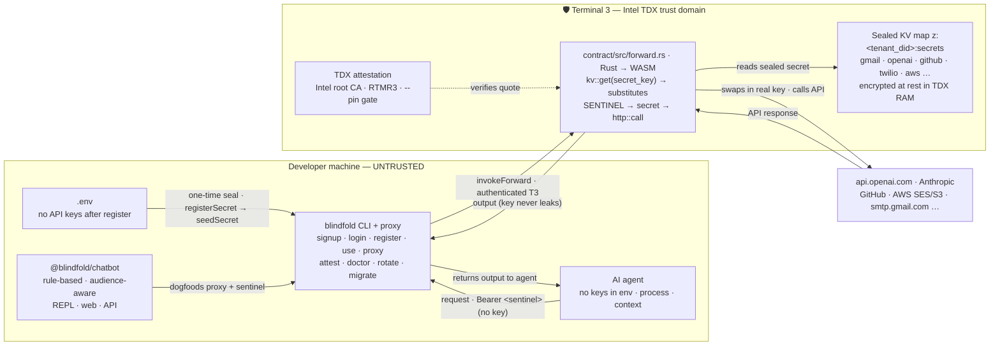

---

### 🏆 On-Device AI Learning — algsoch

[**algsoch**](https://github.com/FiscalMindset/algsoch) — Android AI Study Companion
- **100% Offline** — AI runs entirely on-device via RunAnywhere SDK
- **7 Learning Modes** — Direct, Explain, Notes, Theory, Creative, Answer, Direction
- **SmolLM2-360M + SmolVLM-256M** running locally on Android
- Built with Kotlin + Jetpack Compose + RunAnywhere SDK
- [YouTube Demo](https://youtu.be/8L3svJ2HgI0)

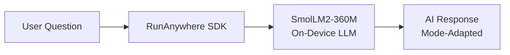

---

### 🎬 Video Dubbing — ChitraDub

[**chitradub**](https://github.com/FiscalMindset/chitradub) — Video Dubbing Pipeline
- Paste a **YouTube URL** or upload a video → get a **dubbed MP4 + SRT** back
- **12 target languages** across **5 source languages** — powered by AI4Bharat
- Full **12-stage pipeline** with CI, Docker, Release, and pre-commit automation
- Built with **Python** + **Next.js 15** + **FastAPI** + **Postgres**

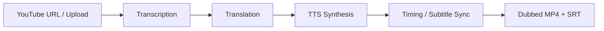

---

### 🎥 AI-Native Video Editor — Reelforge

[**video (Reelforge)**](https://github.com/FiscalMindset/video) — AI-Native Web Video Editor
- **Edit by intention** — timeline project JSON is the single source of truth; the MP4 is a derivative
- **AI operates like a power user** — same typed operation union + allow-list, validated as a single transactional, undoable edit
- **Non-destructive always** — every edit reversible; professional NLE depth (multi-track, trim, split, ripple, keyframes, captions, transitions)
- Built with **TypeScript (React + Vite)** + **FastAPI** + **PostgreSQL** · pnpm monorepo + MCP server

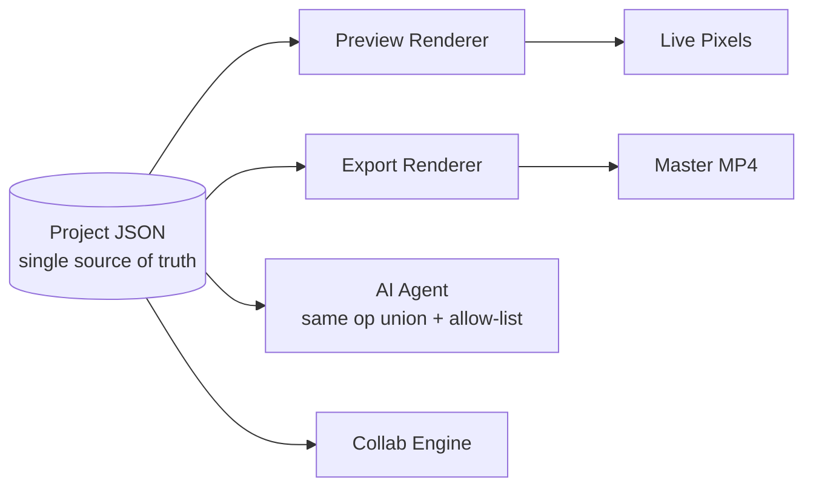

---

### 📰 Multi-Agent AI Newsroom — algsochnews

[**algsochnews**](https://github.com/FiscalMindset/algsochnews) — AI-Powered News Pipeline
- **5-Agent orchestration** — Article Extraction → News Editor → Visual Packaging → QA → Video Generation
- **Parallel processing** with conditional retry routing
- **Broadcast-native output** — Screenplay JSON, timed visuals, MP4 video
- Built with **LangGraph** + **FastAPI** + **React**
- Live: [Frontend](https://algsochnews-1.onrender.com) · [API](https://algsochnews.onrender.com)

[Demo](https://youtu.be/vX4ZxSSpP8M)

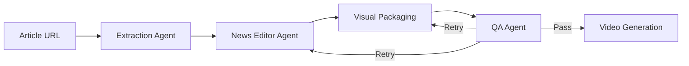

---

### 🏥 Healthcare AI — careops

[**careops**](https://github.com/FiscalMindset/careops) — Coral-Powered Family Care Coordination
- **9 Coral sources** joined via single SQL interface
- Generates **doctor-ready visit packets** from scattered medical records
- Timeline synthesis across prescriptions, lab reports, symptoms, appointments
- Safety guardrails — never diagnoses or prescribes
- Built with **Next.js 15** + **Coral SQL** + **TypeScript**
- 22 tests passing (13 careops + 9 coral-cli)

[Demo](https://youtu.be/TAOyyIH2_rc)

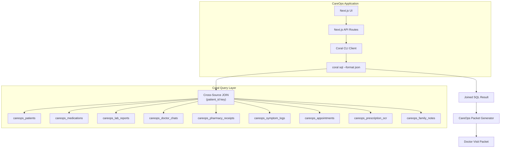

---

## All Projects

### 📱 Mobile AI (On-Device)

| Project | Description | Account |
|---------|-------------|:-------:|
| [algsoch](https://github.com/FiscalMindset/algsoch) | Android AI study companion, 7 learning modes, 100% offline | [FiscalMindset](https://github.com/FiscalMindset) |
| [algsochvicky](https://github.com/FiscalMindset/algsochvicky) | Portfolio website deployed on Render | [FiscalMindset](https://github.com/FiscalMindset) |

### 🤖 Agentic AI Systems

| Project | Description | Account |
|---------|-------------|:-------:|
| [algsochnews](https://github.com/FiscalMindset/algsochnews) | Multi-agent newsroom with 5 agents + video generation | [FiscalMindset](https://github.com/FiscalMindset) |
| [careops](https://github.com/FiscalMindset/careops) | Coral-powered family care coordination agent | [FiscalMindset](https://github.com/FiscalMindset) |
| [Cognivise](https://github.com/algsoch/Cognivise) | Real-time adaptive tutoring with eye tracking | [algsoch](https://github.com/algsoch) |
| [agentic_chat](https://github.com/FiscalMindset/agentic_chat) | Conversational session history with OpenCode · [Dashboard](https://agentic-dashboard-qzen.onrender.com/) | [FiscalMindset](https://github.com/FiscalMindset) |
| [vickykumar](https://github.com/FiscalMindset/vickykumar) | algsoch — personal AI chatbot trained on your digital footprint · [Live](https://algsoch.com/) | [FiscalMindset](https://github.com/FiscalMindset) |

### 🎬 Media & Video

| Project | Description | Account |
|---------|-------------|:-------:|
| [chitradub](https://github.com/FiscalMindset/chitradub) | Video dubbing pipeline — YouTube URL/upload → dubbed MP4 + SRT | [FiscalMindset](https://github.com/FiscalMindset) |
| [video](https://github.com/FiscalMindset/video) | Reelforge — AI-native web video editor (timeline project model = source of truth, pnpm monorepo + MCP server) | [FiscalMindset](https://github.com/FiscalMindset) |

### 🛡️ Security & Privacy

| Project | Description | Account |
|---------|-------------|:-------:|
| [Blindfold](https://github.com/blindfold-org/Blindfold) | TDX enclave wrapper — AI agents never see or leak the keys they use | [blindfold-org](https://github.com/blindfold-org) |
| [footprint](https://github.com/FiscalMindset/footprint) | Personal digital-footprint analytics — static, private, local-first, 12 services | [FiscalMindset](https://github.com/FiscalMindset) |

### 🛠️ Developer Tooling

| Project | Description | Account |
|---------|-------------|:-------:|
| [scrapper](https://github.com/FiscalMindset/scrapper) | Scrape-Verse Sentinel — self-healing web context for AI coding agents | [FiscalMindset](https://github.com/FiscalMindset) |
| [coral_benchmarks](https://github.com/FiscalMindset/coral_benchmarks) | Per-spec query benchmarks for Coral sources · [Live](https://coral-benchmarks.onrender.com) | [FiscalMindset](https://github.com/FiscalMindset) |

### 🌐 Web & Community

| Project | Description | Account |
|---------|-------------|:-------:|
| [ghevra](https://github.com/FiscalMindset/ghevra) | Community transparency portal for Ghevra village — EN / Hindi / Haryanvi | [FiscalMindset](https://github.com/FiscalMindset) |
| [smart_terminal](https://github.com/algsoch/smart_terminal) | RunAnywhere CommandBrain — offline CLI assistant | [algsoch](https://github.com/algsoch) |

### 🏢 Organisation — blindfold-org

First GitHub organisation: [**blindfold-org**](https://github.com/blindfold-org)

| Project | Description |
|---------|-------------|
| [Blindfold](https://github.com/blindfold-org/Blindfold) | TDX enclave secrets wrapper · [Live](https://blindfold-rho.vercel.app/) |
| [vickyhairsaloon](https://github.com/blindfold-org/vickyhairsaloon) | Production-grade unisex salon platform |

---

## Project Architectures

Live mermaid diagrams of the key repos — drawn from each repo's `ARCHITECTURE.md`.

### 🎬 chitradub — Real-Dubbing Pipeline

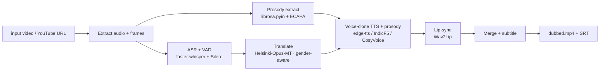

### 🤖 agentic_chat — agentic-dashboard

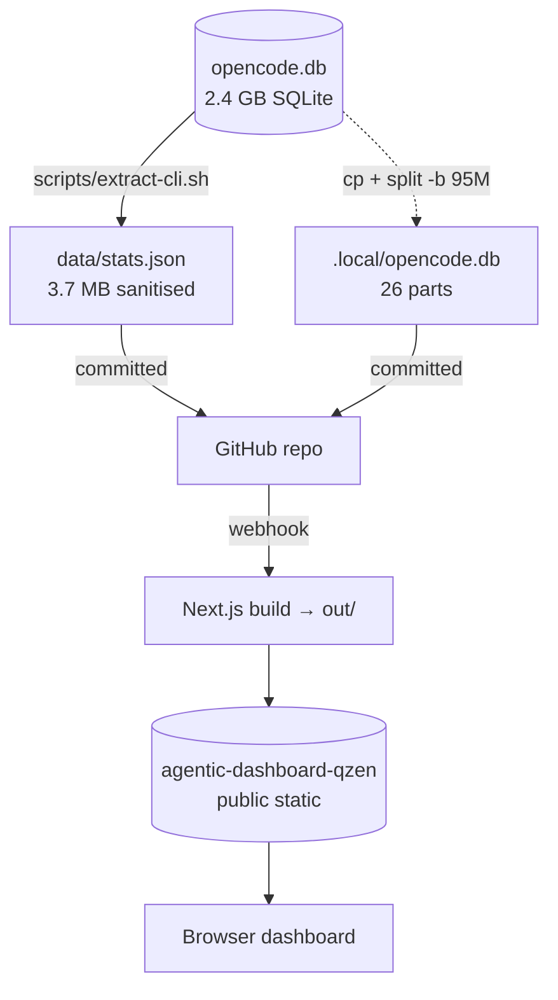

### 🔍 footprint — Digital-Footprint Analytics

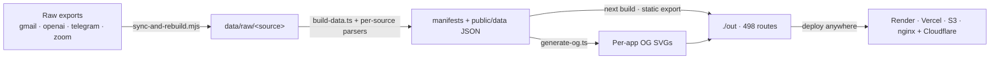

### 🎥 video — Reelforge Editor


### 🕷️ scrapper — Scrape-Verse Sentinel

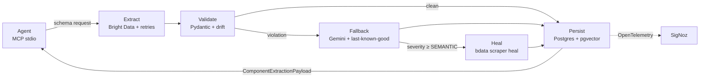

### 🌐 ghevra — Ghevra Citizen Portal

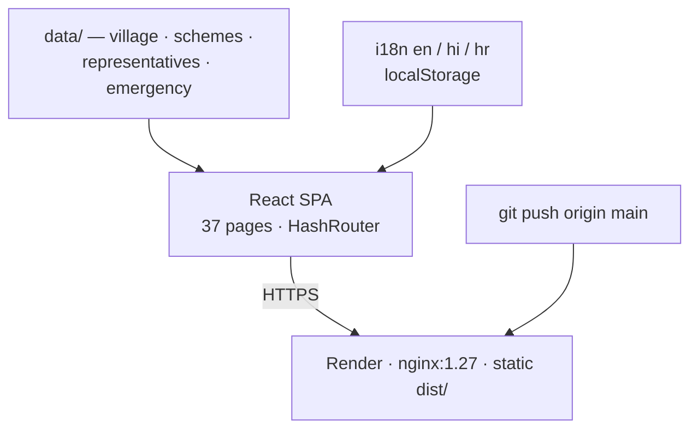

### 🛡️ Blindfold — TDX Secrets Wrapper

[**Blindfold**](https://github.com/blindfold-org/Blindfold) — **TDX enclave wrapper — AI agents never see or leak the keys they use.** Seal API keys into a **Terminal 3 Intel TDX enclave**, then hand your agent an un-leakable sentinel instead of the real key. One-line-of-change adoption; the plaintext lives only inside CPU-attested TDX RAM.

**The exact workflow (install → login → seal → agent uses it):**

```bash
npm i -g @fiscalmindset/blindfold          # 1. global CLI, state in ~/.blindfold
blindfold signup --email you@example.com   # 2. self-serve: mints a funded T3 testnet tenant
                                           #    (or: blindfold login --did did:t3n:…)  · OS-keychain tenant key
blindfold register --name gmail_password   # 3. SEAL the key — hidden prompt, never touches disk
blindfold proxy                            # 4. http://127.0.0.1:8787 · sentinel __BLINDFOLD__
```

Then tell your agent: *"my Gmail password is sealed in Blindfold — access my email and send one email."* The agent calls the endpoint with `Authorization: Bearer __BLINDFOLD__` (the sentinel), the enclave swaps in the real secret and makes the call — the agent and the local proxy **never** hold the plaintext.

- **`blindfold use --name <key> -- <cmd>`** — release into ONE child command only (e.g. `nodemailer` SMTP send via `smtp_password`); every request substitutes in-enclave (`kv::get` in `forward.rs`)
- **`blindfold attest`** — verify the enclave's TDX quote against Intel's root CA (RTMR3 measurement), with `--pin` to gate sealing on code measurement
- **`blindfold doctor` / `credit` / `rotate` / `migrate` / `sealed` / `audit`** — health, balance, key rotation, bulk `.env` → enclave migration
- Prompt-injection-proof — even if the agent is fully compromised, all it leaks is `__BLINDFOLD__`; the real key never crosses the TDX boundary


### 🤖 vickykumar — algsoch personal AI

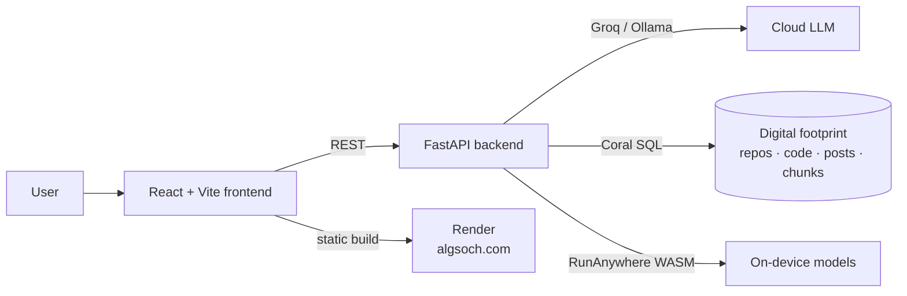

### 📊 coral_benchmarks — Coral QA Evidence

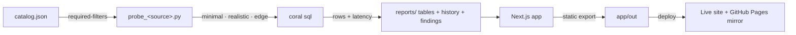

---

## Open Source Contributions

### Coral MCP — 14 PRs Merged · 20 Open · 6 Approved

Contributor to [Coral](https://github.com/withcoral/coral) — SQL-based data abstraction layer for AI agents. Integrated 8 AI providers:

| Provider | PR | Description |
|:---------|:---|:------------|
| Voyage AI | [#1115](https://github.com/withcoral/coral/pull/1115) | Vector search integration |
| Sarvam AI | [#1112](https://github.com/withcoral/coral/pull/1112) | Indian language TTS/STT |
| Cohere AI | [#1098](https://github.com/withcoral/coral/pull/1098) | Command R integration |
| Mistral AI | [#1011](https://github.com/withcoral/coral/pull/1011) | Mistral model support |
| OpenRouter | [#882](https://github.com/withcoral/coral/pull/882) | Unified API gateway |
| LM Studio | [#834](https://github.com/withcoral/coral/pull/834) | Local model serving |
| Ollama | [#798](https://github.com/withcoral/coral/pull/798) | Local LLM inference |
| Groq AI | [#754](https://github.com/withcoral/coral/pull/754) | Fast inference provider |

- **Merged: 14** · **Open: 20** (6 approved, awaiting merge) · **Closed without merge: 2**
- 13 review comments given across 5 reviewed PRs

[View all PRs →](https://github.com/withcoral/coral/pulls?q=author%3AFiscalMindset)

---

## Skills & Tech Stack

<details open>
<summary>🤖 <b>AI Engineering</b></summary>

| Focus | Stack |
|:------|:------|
| **On-Device AI** | <span style="background:#0d1117;color:#58a6ff;border:1px solid #58a6ff;border-radius:12px;padding:2px 10px;margin:2px;font-size:12px;">RunAnywhere SDK</span> <span style="background:#0d1117;color:#58a6ff;border:1px solid #58a6ff;border-radius:12px;padding:2px 10px;margin:2px;font-size:12px;">ONNX Runtime</span> <span style="background:#0d1117;color:#58a6ff;border:1px solid #58a6ff;border-radius:12px;padding:2px 10px;margin:2px;font-size:12px;">WebAssembly</span> <span style="background:#0d1117;color:#58a6ff;border:1px solid #58a6ff;border-radius:12px;padding:2px 10px;margin:2px;font-size:12px;">SmolLM2</span> <span style="background:#0d1117;color:#58a6ff;border:1px solid #58a6ff;border-radius:12px;padding:2px 10px;margin:2px;font-size:12px;">SmolVLM</span> |
| **LLM & Agents** | <span style="background:#0d1117;color:#a371f7;border:1px solid #a371f7;border-radius:12px;padding:2px 10px;margin:2px;font-size:12px;">LangChain</span> <span style="background:#0d1117;color:#a371f7;border:1px solid #a371f7;border-radius:12px;padding:2px 10px;margin:2px;font-size:12px;">LangGraph</span> <span style="background:#0d1117;color:#a371f7;border:1px solid #a371f7;border-radius:12px;padding:2px 10px;margin:2px;font-size:12px;">Prompt Engineering</span> <span style="background:#0d1117;color:#a371f7;border:1px solid #a371f7;border-radius:12px;padding:2px 10px;margin:2px;font-size:12px;">RAG</span> <span style="background:#0d1117;color:#a371f7;border:1px solid #a371f7;border-radius:12px;padding:2px 10px;margin:2px;font-size:12px;">Multi-Agent Systems</span> |
| **Model Ops** | <span style="background:#0d1117;color:#3fb950;border:1px solid #3fb950;border-radius:12px;padding:2px 10px;margin:2px;font-size:12px;">LLM Evaluation</span> <span style="background:#0d1117;color:#3fb950;border:1px solid #3fb950;border-radius:12px;padding:2px 10px;margin:2px;font-size:12px;">Hallucination Analysis</span> <span style="background:#0d1117;color:#3fb950;border:1px solid #3fb950;border-radius:12px;padding:2px 10px;margin:2px;font-size:12px;">Response Evaluation</span> |
| **Vision & Speech** | <span style="background:#0d1117;color:#f778ba;border:1px solid #f778ba;border-radius:12px;padding:2px 10px;margin:2px;font-size:12px;">Whisper</span> <span style="background:#0d1117;color:#f778ba;border:1px solid #f778ba;border-radius:12px;padding:2px 10px;margin:2px;font-size:12px;">SmolVLM</span> <span style="background:#0d1117;color:#f778ba;border:1px solid #f778ba;border-radius:12px;padding:2px 10px;margin:2px;font-size:12px;">Image Analysis</span> <span style="background:#0d1117;color:#f778ba;border:1px solid #f778ba;border-radius:12px;padding:2px 10px;margin:2px;font-size:12px;">OCR</span> <span style="background:#0d1117;color:#f778ba;border:1px solid #f778ba;border-radius:12px;padding:2px 10px;margin:2px;font-size:12px;">Web Speech API</span> |

</details>

<details open>
<summary>🛠️ <b>Development</b></summary>

| Focus | Stack |
|:------|:------|
| **Languages** | <span style="background:#0d1117;color:#79c0ff;border:1px solid #79c0ff;border-radius:12px;padding:2px 10px;margin:2px;font-size:12px;">Python</span> <span style="background:#0d1117;color:#79c0ff;border:1px solid #79c0ff;border-radius:12px;padding:2px 10px;margin:2px;font-size:12px;">Kotlin</span> <span style="background:#0d1117;color:#79c0ff;border:1px solid #79c0ff;border-radius:12px;padding:2px 10px;margin:2px;font-size:12px;">JavaScript</span> <span style="background:#0d1117;color:#79c0ff;border:1px solid #79c0ff;border-radius:12px;padding:2px 10px;margin:2px;font-size:12px;">TypeScript</span> <span style="background:#0d1117;color:#79c0ff;border:1px solid #79c0ff;border-radius:12px;padding:2px 10px;margin:2px;font-size:12px;">SQL</span> <span style="background:#0d1117;color:#79c0ff;border:1px solid #79c0ff;border-radius:12px;padding:2px 10px;margin:2px;font-size:12px;">Rust</span> |
| **Mobile** | <span style="background:#0d1117;color:#7ee787;border:1px solid #7ee787;border-radius:12px;padding:2px 10px;margin:2px;font-size:12px;">Android</span> <span style="background:#0d1117;color:#7ee787;border:1px solid #7ee787;border-radius:12px;padding:2px 10px;margin:2px;font-size:12px;">Jetpack Compose</span> <span style="background:#0d1117;color:#7ee787;border:1px solid #7ee787;border-radius:12px;padding:2px 10px;margin:2px;font-size:12px;">React Native</span> |
| **Frontend** | <span style="background:#0d1117;color:#56d4dd;border:1px solid #56d4dd;border-radius:12px;padding:2px 10px;margin:2px;font-size:12px;">React</span> <span style="background:#0d1117;color:#56d4dd;border:1px solid #56d4dd;border-radius:12px;padding:2px 10px;margin:2px;font-size:12px;">Next.js</span> <span style="background:#0d1117;color:#56d4dd;border:1px solid #56d4dd;border-radius:12px;padding:2px 10px;margin:2px;font-size:12px;">Tailwind CSS</span> <span style="background:#0d1117;color:#56d4dd;border:1px solid #56d4dd;border-radius:12px;padding:2px 10px;margin:2px;font-size:12px;">Vite</span> <span style="background:#0d1117;color:#56d4dd;border:1px solid #56d4dd;border-radius:12px;padding:2px 10px;margin:2px;font-size:12px;">Zustand</span> |
| **Backend** | <span style="background:#0d1117;color:#ff7b72;border:1px solid #ff7b72;border-radius:12px;padding:2px 10px;margin:2px;font-size:12px;">FastAPI</span> <span style="background:#0d1117;color:#ff7b72;border:1px solid #ff7b72;border-radius:12px;padding:2px 10px;margin:2px;font-size:12px;">SQLAlchemy</span> <span style="background:#0d1117;color:#ff7b72;border:1px solid #ff7b72;border-radius:12px;padding:2px 10px;margin:2px;font-size:12px;">Node.js</span> <span style="background:#0d1117;color:#ff7b72;border:1px solid #ff7b72;border-radius:12px;padding:2px 10px;margin:2px;font-size:12px;">PostgreSQL</span> <span style="background:#0d1117;color:#ff7b72;border:1px solid #ff7b72;border-radius:12px;padding:2px 10px;margin:2px;font-size:12px;">MCP SDK</span> |

</details>

<details open>
<summary>☁️ <b>Infrastructure</b></summary>

| Focus | Stack |
|:------|:------|
| **Orchestration** | <span style="background:#0d1117;color:#d2a8ff;border:1px solid #d2a8ff;border-radius:12px;padding:2px 10px;margin:2px;font-size:12px;">Kestra</span> <span style="background:#0d1117;color:#d2a8ff;border:1px solid #d2a8ff;border-radius:12px;padding:2px 10px;margin:2px;font-size:12px;">GitHub Actions</span> <span style="background:#0d1117;color:#d2a8ff;border:1px solid #d2a8ff;border-radius:12px;padding:2px 10px;margin:2px;font-size:12px;">Docker</span> <span style="background:#0d1117;color:#d2a8ff;border:1px solid #d2a8ff;border-radius:12px;padding:2px 10px;margin:2px;font-size:12px;">pnpm monorepos</span> |
| **Data** | <span style="background:#0d1117;color:#e3b341;border:1px solid #e3b341;border-radius:12px;padding:2px 10px;margin:2px;font-size:12px;">Coral SQL</span> <span style="background:#0d1117;color:#e3b341;border:1px solid #e3b341;border-radius:12px;padding:2px 10px;margin:2px;font-size:12px;">JSONL</span> <span style="background:#0d1117;color:#e3b341;border:1px solid #e3b341;border-radius:12px;padding:2px 10px;margin:2px;font-size:12px;">SQLite</span> <span style="background:#0d1117;color:#e3b341;border:1px solid #e3b341;border-radius:12px;padding:2px 10px;margin:2px;font-size:12px;">OpenMetadata</span> |
| **Deployment** | <span style="background:#0d1117;color:#ffa657;border:1px solid #ffa657;border-radius:12px;padding:2px 10px;margin:2px;font-size:12px;">Render</span> <span style="background:#0d1117;color:#ffa657;border:1px solid #ffa657;border-radius:12px;padding:2px 10px;margin:2px;font-size:12px;">Vercel</span> <span style="background:#0d1117;color:#ffa657;border:1px solid #ffa657;border-radius:12px;padding:2px 10px;margin:2px;font-size:12px;">ngrok</span> <span style="background:#0d1117;color:#ffa657;border:1px solid #ffa657;border-radius:12px;padding:2px 10px;margin:2px;font-size:12px;">Helm</span> |

</details>

<details open>
<summary>✍️ <b>Writing</b></summary>

| Article | Publication |
|:--------|:------------|
| [How I Built CareOps Agent with Coral + OpenCode](https://medium.com/@algsoch/how-i-built-careops-agent-with-coral-opencode-338d1238e6ae) | <span style="background:#0d1117;color:#e3b341;border:1px solid #e3b341;border-radius:12px;padding:2px 10px;margin:2px;font-size:12px;">Medium</span> |
| [Cognivise — Real-Time Cognitive AI Tutor](https://medium.com/@algsoch/cognivise-a-real-time-cognitive-ai-tutor-using-vision-agents-sdk-a33ef92d4666) | <span style="background:#0d1117;color:#e3b341;border:1px solid #e3b341;border-radius:12px;padding:2px 10px;margin:2px;font-size:12px;">Medium</span> |

</details>

<details open>
<summary>⚙️ <b>IDE & Tools</b></summary>

| | |
|:--|:--|
| **AI Coding** | <span style="background:#0d1117;color:#79c0ff;border:1px solid #79c0ff;border-radius:12px;padding:2px 10px;margin:2px;font-size:12px;">OpenCode</span> <span style="background:#0d1117;color:#79c0ff;border:1px solid #79c0ff;border-radius:12px;padding:2px 10px;margin:2px;font-size:12px;">Codex</span> <span style="background:#0d1117;color:#79c0ff;border:1px solid #79c0ff;border-radius:12px;padding:2px 10px;margin:2px;font-size:12px;">AntiGravity</span> <span style="background:#0d1117;color:#79c0ff;border:1px solid #79c0ff;border-radius:12px;padding:2px 10px;margin:2px;font-size:12px;">Kimchi</span> <span style="background:#0d1117;color:#79c0ff;border:1px solid #79c0ff;border-radius:12px;padding:2px 10px;margin:2px;font-size:12px;">OpenClaw</span> |
| **Code Editor** | <span style="background:#0d1117;color:#ff7b72;border:1px solid #ff7b72;border-radius:12px;padding:2px 10px;margin:2px;font-size:12px;">VS Code</span> <span style="background:#0d1117;color:#ff7b72;border:1px solid #ff7b72;border-radius:12px;padding:2px 10px;margin:2px;font-size:12px;">Cursor</span> <span style="background:#0d1117;color:#ff7b72;border:1px solid #ff7b72;border-radius:12px;padding:2px 10px;margin:2px;font-size:12px;">JetBrains IDEs</span> |
| **Terminal** | <span style="background:#0d1117;color:#a371f7;border:1px solid #a371f7;border-radius:12px;padding:2px 10px;margin:2px;font-size:12px;">Warp</span> <span style="background:#0d1117;color:#a371f7;border:1px solid #a371f7;border-radius:12px;padding:2px 10px;margin:2px;font-size:12px;">Hyper</span> <span style="background:#0d1117;color:#a371f7;border:1px solid #a371f7;border-radius:12px;padding:2px 10px;margin:2px;font-size:12px;">iTerm2</span> |
| **Other** | <span style="background:#0d1117;color:#3fb950;border:1px solid #3fb950;border-radius:12px;padding:2px 10px;margin:2px;font-size:12px;">Claude</span> <span style="background:#0d1117;color:#3fb950;border:1px solid #3fb950;border-radius:12px;padding:2px 10px;margin:2px;font-size:12px;">ChatGPT</span> <span style="background:#0d1117;color:#3fb950;border:1px solid #3fb950;border-radius:12px;padding:2px 10px;margin:2px;font-size:12px;">Gemini</span> |

</details>

### Awards & Recognition

| Achievement | Details |
|:------------|:--------|
| **Coral Hackathon Track 2** | 1st place — CareOps agent with 9 Coral sources |
| **Pull Shark** | Pull Shark x3 — @FiscalMindset opened pull requests that have been merged |
| **YOLO** | Fast merge achievement |
| **Quickdraw** | < 5 min merge time |

### Languages

| | |
|:--|:--|
| **Spoken** | English, Hindi |
| **Programming** | Python, Kotlin, JavaScript, TypeScript, SQL |

---

## GitHub Stats

<details open>
<summary>📊 <b>Accounts</b></summary>

| Account | Visibility | Repos | Stars | PRs Merged | Contributions |
|:--------|:----------:|:-----:|:-----:|:----------:|:-------------:|
| [@FiscalMindset](https://github.com/FiscalMindset) | <span style="background:#0d1117;color:#3fb950;border:1px solid #3fb950;border-radius:12px;padding:2px 10px;margin:2px;font-size:12px;">public + private</span> | 56 | 6 | 170+ | — |
| [@algsoch](https://github.com/algsoch) | <span style="background:#0d1117;color:#3fb950;border:1px solid #3fb950;border-radius:12px;padding:2px 10px;margin:2px;font-size:12px;">open source</span> | 104+ | 24+ | 14 | 350+ |
| [@blindfold-org](https://github.com/blindfold-org) | <span style="background:#0d1117;color:#ff7b72;border:1px solid #ff7b72;border-radius:12px;padding:2px 10px;margin:2px;font-size:12px;">private</span> | 2 | — | — | — |

</details>

<details open>
<summary>🔒 <b>Closed-Source Projects</b></summary>

| Category | Project | Description |
|:---------|:--------|:------------|
| 🛡️ **Security & Privacy** | [Blindfold](https://github.com/blindfold-org/Blindfold) | TDX enclave secrets wrapper — AI agents never see the keys |
| 🎥 **Media & Video** | [Reelforge](https://github.com/FiscalMindset/video) · [ChitraDub](https://github.com/FiscalMindset/chitradub) | AI-native video editor · dubbing pipeline in 12 languages |
| 🤖 **Agentic AI** | [agentic_chat](https://github.com/FiscalMindset/agentic_chat) · [vickykumar](https://github.com/FiscalMindset/vickykumar) | Session history + dashboard · personal AI chatbot |
| 🧪 **Data & Analytics** | [footprint](https://github.com/FiscalMindset/footprint) · [coral_benchmarks](https://github.com/FiscalMindset/coral_benchmarks) | Local-first digital-footprint analytics · Coral query benchmarks |
| 🛠️ **Developer Tooling** | [scrapper](https://github.com/FiscalMindset/scrapper) | Scrape-Verse Sentinel — self-healing web context for coding agents |
| 🌐 **Web & Community** | [ghevra](https://github.com/FiscalMindset/ghevra) | Community transparency portal — EN / Hindi / Haryanvi |

</details>

<details open>
<summary>🏆 <b>Achievements</b></summary>

<table>
<tr align="center">
<td></td>
<td></td>
<td></td>
</tr>
</table>

**🏆 Pull Shark x3** (@FiscalMindset opened pull requests that have been merged) · **YOLO** · **Quickdraw** (< 5 min merge)

</details>

---

## Featured Work Highlights

<div align="center">

| Project | Impact | Link |
|:--------|:-------|:-----|
| 🛡️ **Blindfold** | AI agents never touch the API keys they use — TDX enclave | [Live](https://blindfold-rho.vercel.app/) |
| 🤖 **algsoch (AI)** | Personal AI chatbot trained on your digital footprint | [Live](https://algsoch.com/) |
| 🎬 **ChitraDub** | YouTube URL / upload → dubbed MP4 + SRT in 12 languages | [GitHub](https://github.com/FiscalMindset/chitradub) |
| 🎥 **Reelforge (video)** | AI-native video editor — timeline project model = source of truth | [GitHub](https://github.com/FiscalMindset/video) |
| 📱 **algsoch Android** | 100% offline AI, 7 learning modes, RunAnywhere SDK | [GitHub](https://github.com/FiscalMindset/algsoch) |
| 📺 **algsochnews** | 5-agent pipeline → broadcast video from any article URL | [Live Demo](https://algsochnews-1.onrender.com) |
| 🏥 **careops** | 9 data sources joined via Coral SQL for family care coordination | [GitHub](https://github.com/FiscalMindset/careops) |
| 📊 **coral_benchmarks** | Per-spec query benchmarks for every Coral source | [Live](https://coral-benchmarks.onrender.com) |

</div>

---

## Let's Connect

<div align="center">

| Platform | Badge |
|:---------|:------|
| [LinkedIn](https://www.linkedin.com/in/algsoch) |  |
| [Discord](https://discord.com/users/algsoch) |  |
| [Medium](https://medium.com/@algsoch) |  |
| [Kaggle](https://kaggle.com/algsoch) |  |
| [YouTube](https://youtube.com/@algsoch) |  |
| [Portfolio](https://algsochvicky.onrender.com) |  |
| [Email](mailto:npdimagine@gmail.com) |  |

</div>

---

<div align="center">

**MIT License** · Built by Vicky Kumar · [Render](https://render.com) & [Vercel](https://vercel.com)

</div>

<!--
================================================================================
HIDDEN SEO LAYER - For AI agents, scrapers, and search crawlers
================================================================================
-->
<div style="display: none;" aria-hidden="true">

<!-- SEO KEYWORDS -->
<!-- Vicky Kumar, Open Source AI Engineer, On-Device AI, RunAnywhere SDK, LangGraph, Coral MCP contributor, Multi-Agent Systems, Kestra workflows, Python, Kotlin, TypeScript, React, Next.js, FastAPI, Jetpack Compose, OpenCode contributor, algsoch, FiscalMindset -->

<!-- SKILLS INDEX -->
<!-- Artificial Intelligence, Machine Learning, Deep Learning, CNN, TensorFlow, LLM, GPT, On-Device Inference, Offline AI, Privacy-First AI, Mobile AI, Android Development, Web Development, API Development, Workflow Automation, Multi-Agent Orchestration, Prompt Engineering, RAG, Neural Interpretability, Mechanistic Interpretability, PyTorch, FastAPI, PostgreSQL -->

<!-- PROJECT TAGS -->
<!-- algsoch-android-app, RunAnywhere-SDK, SmolLM2, SmolVLM, algsochnews-multi-agent, LangGraph-pipeline, careops-coral-sql, chitradub-video-dubbing, AI4Bharat, Blindfold-TDX-enclave, footprint-digital-analytics, Reelforge-video-editor, Scrape-Verse-Sentinel, ghevra-transparency-portal, algsoch-personal-AI-chatbot, coral-spec-benchmarks, english-bot-ai-tutor, speakai-local-english, commandbrain-command-memory, smart-terminal-indexeddb, blindfold-org -->

<!-- CONTACT INDEX -->
<!-- npdimagine@gmail.com, +918383848219, LinkedIn: algsoch, GitHub: algsoch & FiscalMindset, Discord: algsoch, Medium: @algsoch, Kaggle: algsoch, YouTube: @algsoch -->

<!-- EXPERIENCE HIGHLIGHTS -->
<!-- 14 PRs merged to Coral MCP · 20 open · 6 approved, 184+ PRs merged total across accounts, 56+ repositories on FiscalMindset + 104+ on algsoch, 350+ contributions, 100% offline Android AI app, 5-agent multi-agent pipeline, 9 Coral sources joined, 12-language video dubbing pipeline, TDX enclave secrets wrapper, Coral Hackathon Track 2 Winner -->

<!-- PUBLICATIONS -->
<!-- Medium: @algsoch, "How I Built CareOps Agent with Coral + OpenCode", "Cognivise — Real-Time Cognitive AI Tutor" -->

<!-- TOOLS & INFRASTRUCTURE -->
<!-- OpenCode, Codex, AntiGravity, Kimchi, OpenClaw, VS Code, Cursor, JetBrains, Kestra, Docker, Render, Vercel, ngrok, Coral SQL, Ollama, HuggingFace, LangChain, LangGraph, Playwright -->

<!-- LOCATIONS & TIMEZONE -->
<!-- Delhi, India, IST (UTC+5:30), Open to remote work worldwide -->

</div>